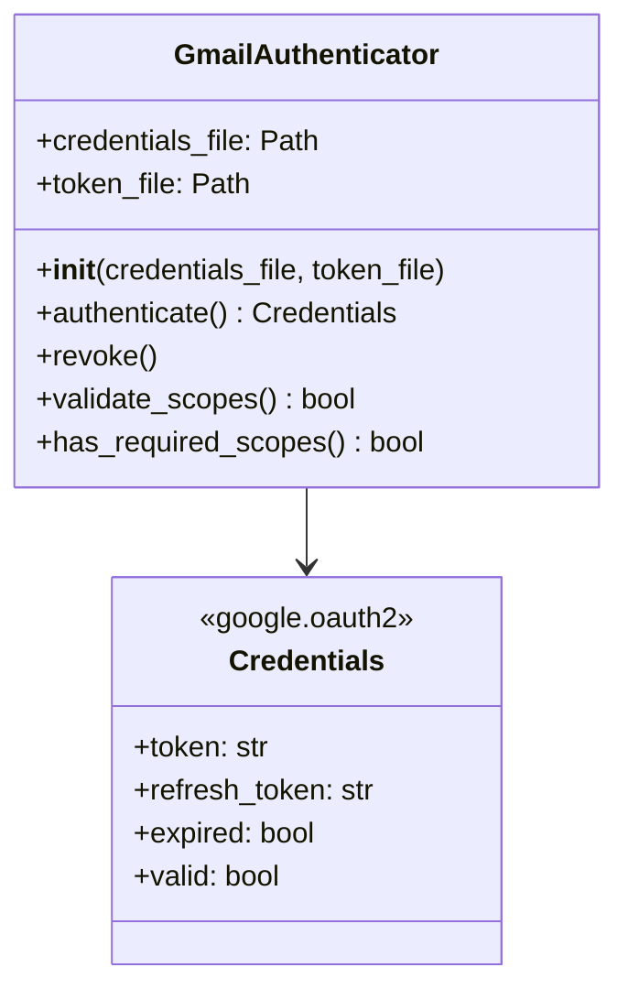
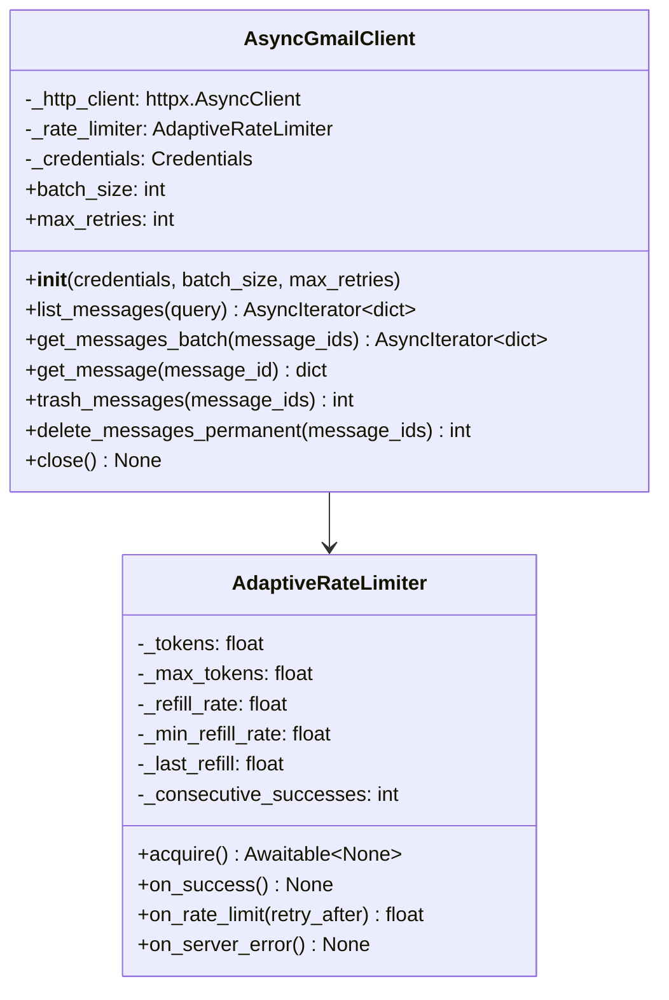
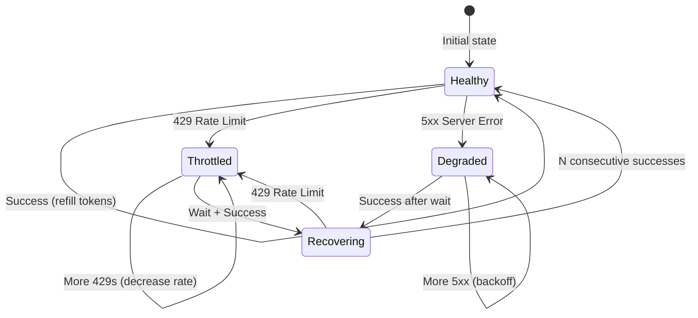
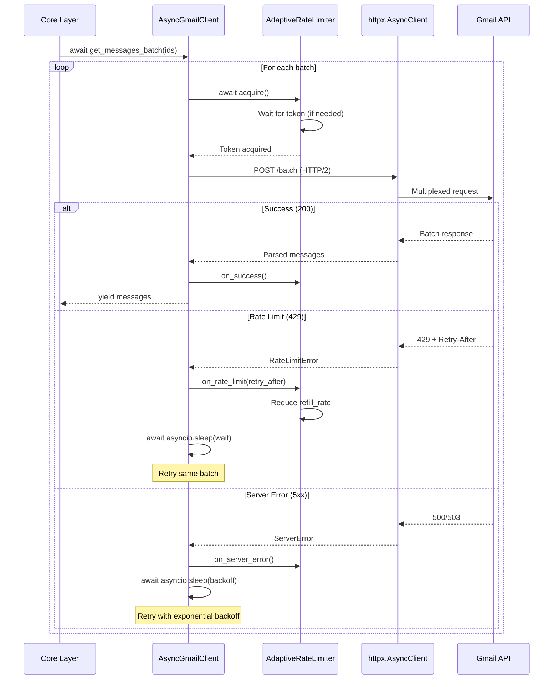
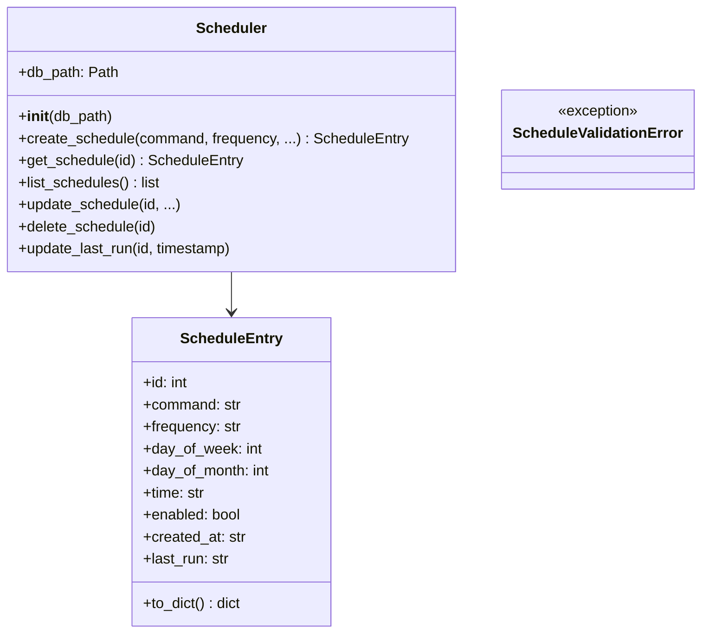
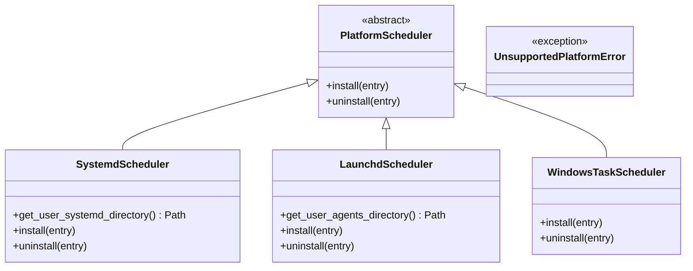
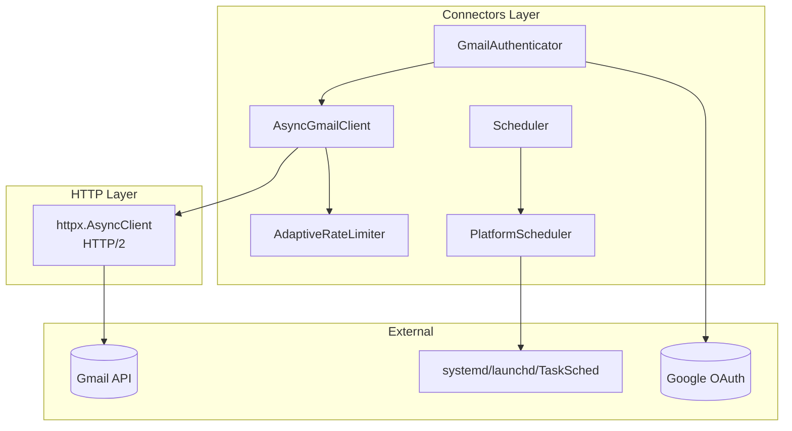
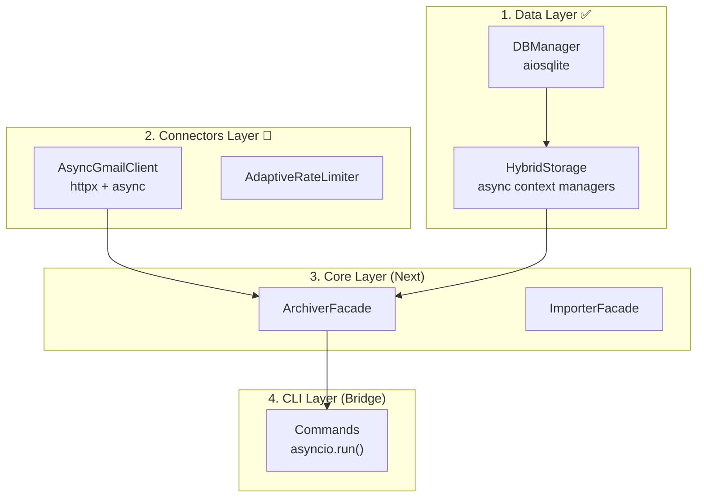

# Connectors Layer Architecture

**Last Updated:** 2025-12-13

The connectors layer provides external system integrations: Gmail API access, OAuth authentication, and platform-specific scheduling.

---

## Layer Contract

| Property | Value |
|----------|-------|
| **Dependencies** | `shared` layer only |
| **Dependents** | `core`, `cli` layers |
| **Responsibility** | Gmail API, OAuth2, platform scheduling |
| **Concurrency Model** | Async-first with asyncio (v1.6.0+) |
| **HTTP Library** | httpx (HTTP/2 support) |

---

## Components

### GmailAuthenticator

OAuth2 authentication flow with bundled credentials support.



#### Interface

- **Authenticate**: `authenticate()` returns valid Google OAuth2 credentials
- **Token storage**: Saves/loads tokens from XDG-compliant paths
- **Bundled credentials**: Uses app credentials by default, no user setup required
- **Scope validation**: `validate_scopes()` checks if token has required permissions

#### Key Functions

| Function | Purpose |
|----------|---------|
| `_get_bundled_credentials_path()` | Get path to bundled OAuth credentials |
| `_get_default_token_path()` | Get XDG-compliant token storage path |

---

### GmailClient (Async)

Async Gmail API client with adaptive rate limiting and HTTP/2 support.



#### Async Interface

All methods are async and non-blocking:

| Method | Purpose | Returns |
|--------|---------|---------|
| `list_messages(query)` | Query Gmail with pagination | `AsyncIterator[dict]` |
| `get_messages_batch(ids)` | Fetch multiple messages | `AsyncIterator[dict]` |
| `get_message(id)` | Fetch single message | `dict` |
| `trash_messages(ids)` | Move to trash | `int` (count) |
| `delete_messages_permanent(ids)` | Permanently delete | `int` (count) |

#### Adaptive Rate Limiting

The `AdaptiveRateLimiter` uses a token bucket algorithm with dynamic rate adjustment:



**Token Bucket Parameters:**

| Parameter | Default | Description |
|-----------|---------|-------------|
| `max_tokens` | 20 | Burst capacity |
| `refill_rate` | 10/sec | Sustained rate (baseline) |
| `min_refill_rate` | 1/sec | Floor when heavily throttled |
| `backoff_factor` | 0.5 | Rate reduction on 429 |
| `recovery_threshold` | 10 | Successes before rate increase |

**Behavior:**

1. **Normal operation**: Token bucket allows bursts up to 20 requests, sustains 10 req/sec
2. **On 429**: Reduce refill rate by 50%, wait for `Retry-After` header (or exponential backoff)
3. **On 5xx**: Short backoff, don't reduce rate (transient error)
4. **Recovery**: After 10 consecutive successes, increase rate by 10% (up to baseline)

#### Request Flow (Async)



#### HTTP/2 Benefits

Using httpx with HTTP/2 provides:

- **Multiplexing**: Multiple requests over single connection (reduces TCP overhead)
- **Header compression**: HPACK reduces bandwidth
- **Server push**: (Not used by Gmail API, but available)
- **Better latency**: No head-of-line blocking

```python
# HTTP/2 enabled by default with httpx
async with httpx.AsyncClient(http2=True) as client:
    response = await client.get("https://gmail.googleapis.com/...")
```

#### Why No Circuit Breaker

We use adaptive rate limiting instead of a full circuit breaker because:

1. **Single-user CLI**: No need to protect downstream services
2. **Predictable API**: Gmail has quota-based limits, not capacity-based
3. **User experience**: Circuit breaker "open" state blocks ALL requests
4. **Gmail behavior**: 429 errors include `Retry-After` guidance

Adaptive rate limiting provides the benefits (backoff, recovery) without the "punishing" aspect of blocking all requests.

---

### Scheduler

Schedule storage and management (database-backed).



#### Interface

- **CRUD operations**: Create, read, update, delete schedules
- **Validation**: Ensures schedule parameters are valid
- **Persistence**: SQLite-backed storage

---

### PlatformScheduler

Platform-specific scheduling implementations.



#### Platform Support

| Platform | Implementation | Location |
|----------|---------------|----------|
| **Linux** | systemd timers | `~/.config/systemd/user/` |
| **macOS** | launchd plists | `~/Library/LaunchAgents/` |
| **Windows** | Task Scheduler | Windows Task Scheduler |

---

## Data Flow



### Async Migration Strategy

The connectors layer is part of the bottom-up async migration:



**Key Principle:** CLI layer is the ONLY place where `asyncio.run()` bridges sync commands to async processing.

---

## Security Considerations

### OAuth Credentials

- Bundled credentials are "installed application" type (client secret not confidential)
- Security relies on user consent at authorization time
- Users can provide custom credentials via `--credentials` flag

### Scopes

- **Current scope**: `https://mail.google.com/` (full Gmail access)
- Required for permanent deletion (`messages.delete` API)
- Breaking change from earlier versions - requires re-auth

### Token Storage

- Tokens stored in XDG-compliant paths
- Permissions: user-only readable (0600)
- Refresh tokens allow offline access

---

## Testing Strategy

| Component | Test Focus | Async |
|-----------|------------|-------|
| `GmailAuthenticator` | OAuth flow mocking, token refresh, scope validation | No |
| `AsyncGmailClient` | API responses, retry logic, batch operations | Yes |
| `AdaptiveRateLimiter` | Token bucket behavior, backoff, recovery | Yes |
| `Scheduler` | CRUD operations, validation, edge cases | No |
| `PlatformScheduler` | File generation (no actual installation in tests) | No |

### Async Testing Patterns

```python
import pytest
from unittest.mock import AsyncMock, patch

@pytest.mark.asyncio
async def test_rate_limiter_backs_off_on_429():
    """Test that rate limiter reduces rate on 429 errors."""
    limiter = AdaptiveRateLimiter()
    initial_rate = limiter.refill_rate

    # Simulate 429 response
    wait_time = limiter.on_rate_limit(retry_after=5.0)

    assert wait_time == 5.0  # Respects Retry-After
    assert limiter.refill_rate < initial_rate  # Rate reduced

@pytest.mark.asyncio
async def test_client_uses_http2():
    """Test that client creates HTTP/2 connection."""
    with patch("httpx.AsyncClient") as mock_client:
        async with AsyncGmailClient(credentials) as client:
            pass
        mock_client.assert_called_with(http2=True, ...)
```

### Mock Fixtures

```python
@pytest.fixture
def mock_gmail_api():
    """Mock Gmail API responses for testing."""
    return {
        "messages": [{"id": "msg1"}, {"id": "msg2"}],
        "nextPageToken": None,
    }

@pytest.fixture
def mock_rate_limited_response():
    """Mock 429 response with Retry-After header."""
    return httpx.Response(
        429,
        headers={"Retry-After": "5"},
        json={"error": {"code": 429, "message": "Rate limit exceeded"}},
    )
```

See `tests/connectors/` for test implementations.
