# Core Layer Architecture

**Last Updated:** 2025-11-26

The core layer contains business logic for email archiving operations: archiving, validation, consolidation, deduplication, search, extraction, compression, and diagnostics.

---

## Layer Contract

| Property | Value |
|----------|-------|
| **Dependencies** | `shared`, `data`, `connectors` layers |
| **Dependents** | `cli` layer, `workflows` module |
| **Responsibility** | Business logic for all archiving operations |
| **Thread Safety** | Components are not thread-safe (use separate instances per thread) |

### Critical Architecture Rule

**ALL database access MUST go through HybridStorage.**

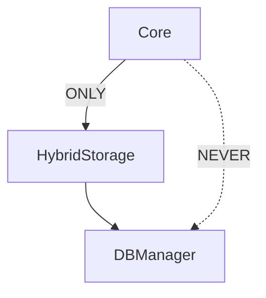

**Rationale:**
- HybridStorage provides transactional guarantees
- Ensures atomic operations across mbox + database
- Centralizes validation and integrity checking
- Maintains the single entry point principle

---

## Components

### GmailArchiver

Main archiving orchestrator - coordinates Gmail fetch, mbox write, and database operations.

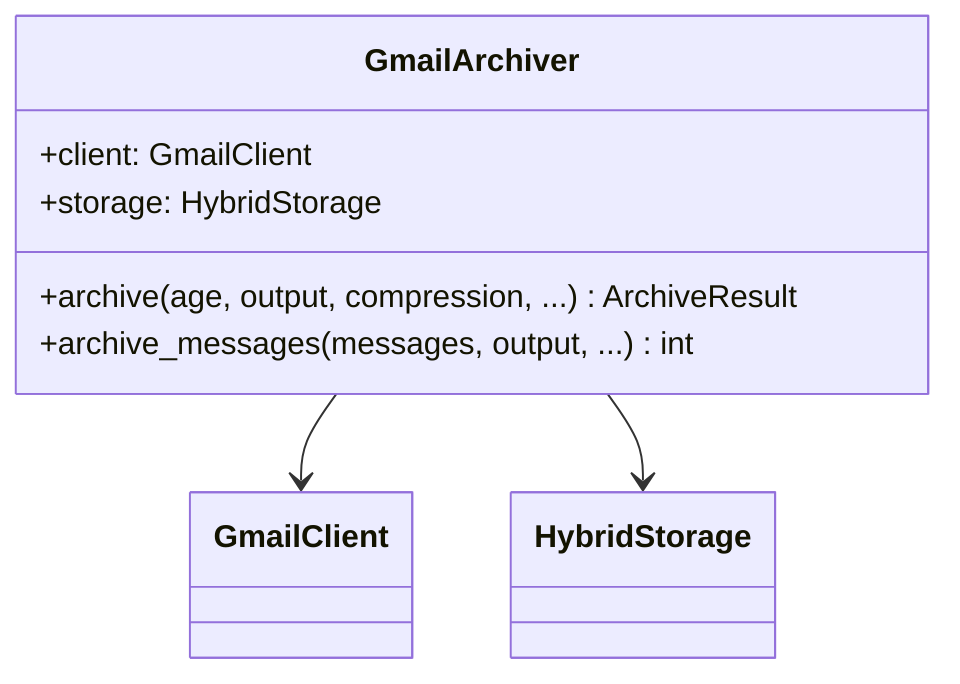

### ArchiveValidator

Multi-layer archive validation before deletion.

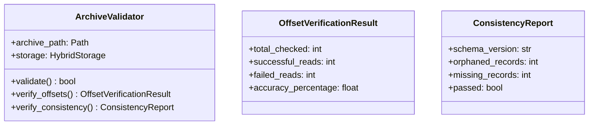

### ArchiveImporter

Import existing mbox archives into database.

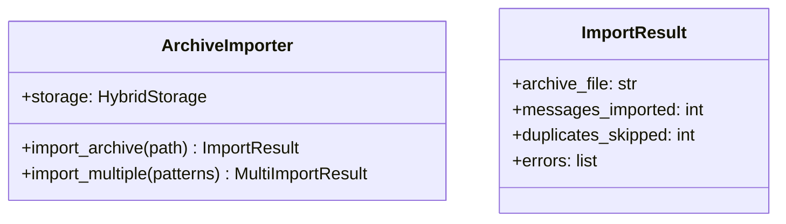

### ArchiveConsolidator

Merge multiple archives into one.

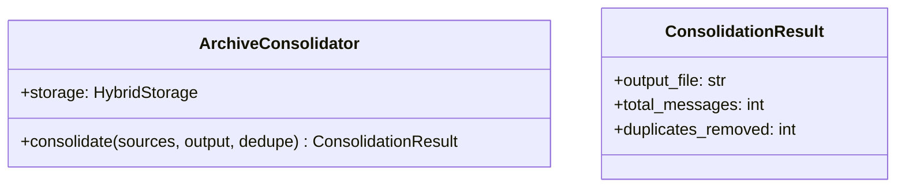

### MessageDeduplicator

Message-ID based deduplication across archives.

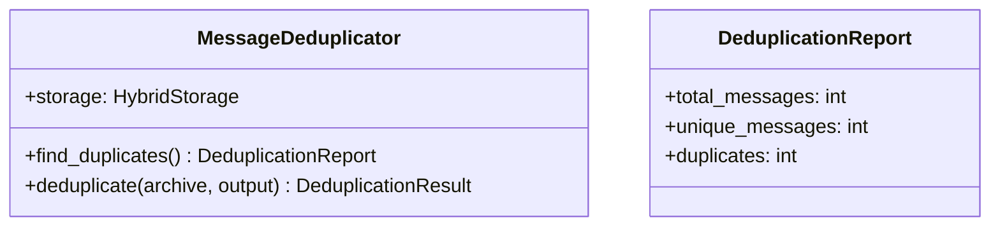

### SearchEngine

Full-text search via SQLite FTS5.

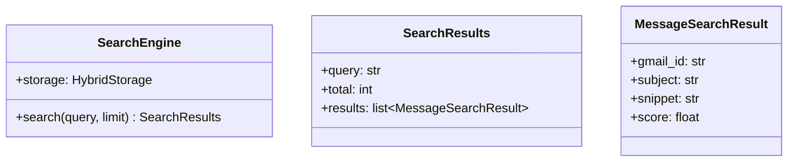

### MessageExtractor

Extract messages from archives by ID or criteria.

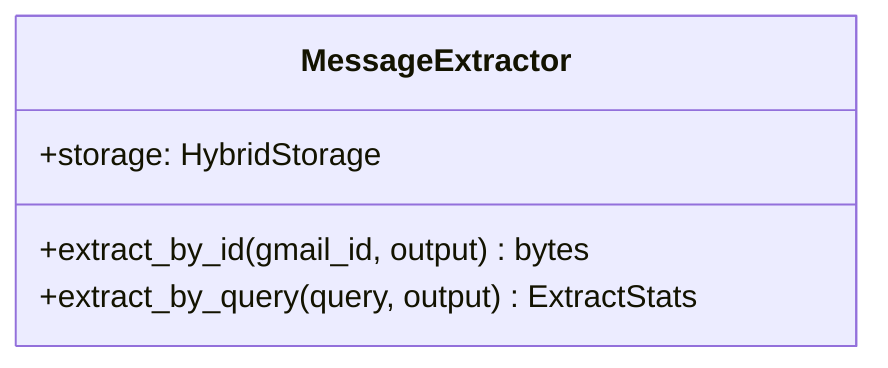

### ArchiveCompressor

Compress/decompress archive files.

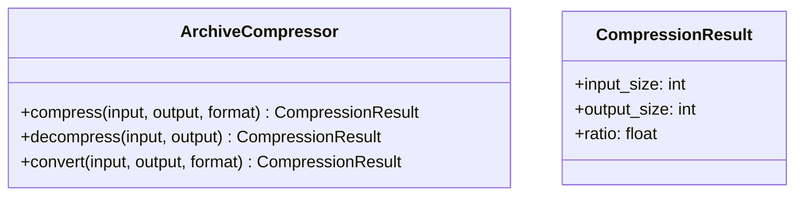

### Doctor

System diagnostics and auto-repair.

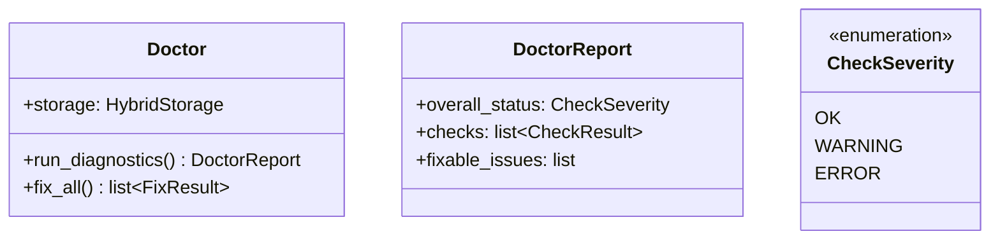

---

## Data Flow

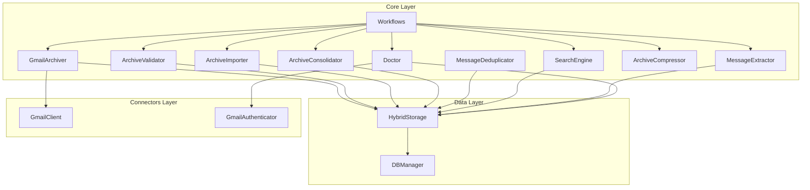

## Workflows Module

The workflows module contains async business logic for CLI commands:

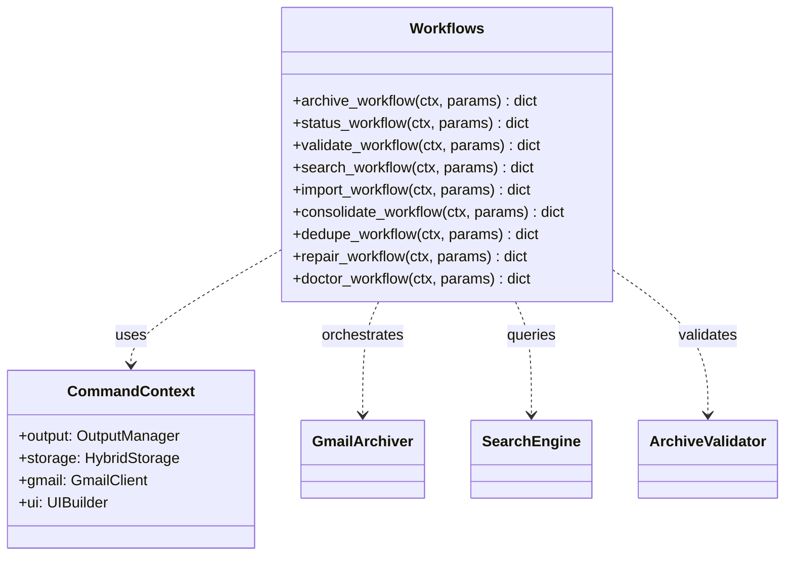

### Workflow Pattern

Each workflow:
- Is **async** (business logic)
- Takes **CommandContext** for dependencies
- Returns **structured data** for CLI formatting
- Uses **facades** for core operations
- Reports **progress** via CommandContext

**Example:**
```python
async def archive_workflow(
    ctx: CommandContext,
    age_threshold: str,
    output: str | None,
    compress: str | None,
    # ... other params
) -> dict[str, Any]:
    """Async implementation of archive command."""
    
    # Use facades for business logic
    archiver = ArchiverFacade(ctx.gmail, ctx.storage)
    
    # Report progress
    with ctx.ui.task_sequence() as seq:
        with seq.task("Authenticating") as t:
            await ctx.authenticate_gmail()
            t.complete("Connected")
            
        with seq.task("Archiving") as t:
            result = await archiver.archive(age_threshold, output, compress)
            t.complete(f"Archived {result.count} messages")
    
    # Return structured data for CLI
    return {
        "status": "success",
        "archived": result.count,
        "output_file": result.file,
    }
```

---

## Testing Strategy

| Component | Test Focus |
|-----------|------------|
| `GmailArchiver` | Atomic operations, incremental mode, compression |
| `ArchiveValidator` | Offset verification, consistency checks |
| `ArchiveImporter` | Glob patterns, deduplication, error handling |
| `ArchiveConsolidator` | Merge operations, offset updates |
| `MessageDeduplicator` | Message-ID matching, preservation logic |
| `SearchEngine` | FTS5 queries, ranking, Gmail syntax |
| `MessageExtractor` | Offset-based retrieval, compression support |
| `ArchiveCompressor` | All formats, streaming, integrity |
| `Doctor` | Diagnostics, auto-fix, edge cases |
| `Workflows` | Business logic orchestration, error handling, progress reporting |

See `tests/core/` for test implementations.
