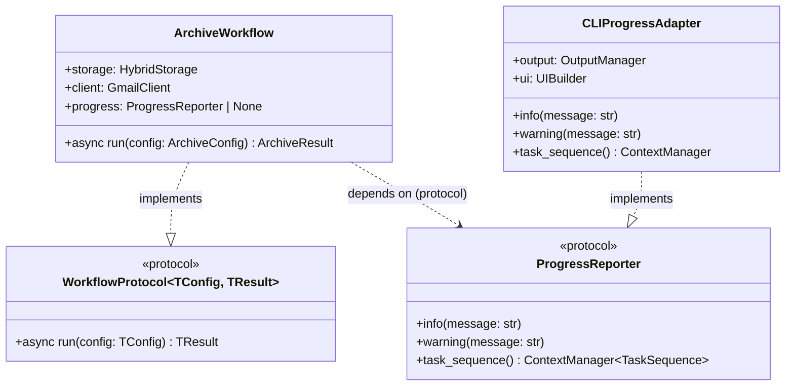
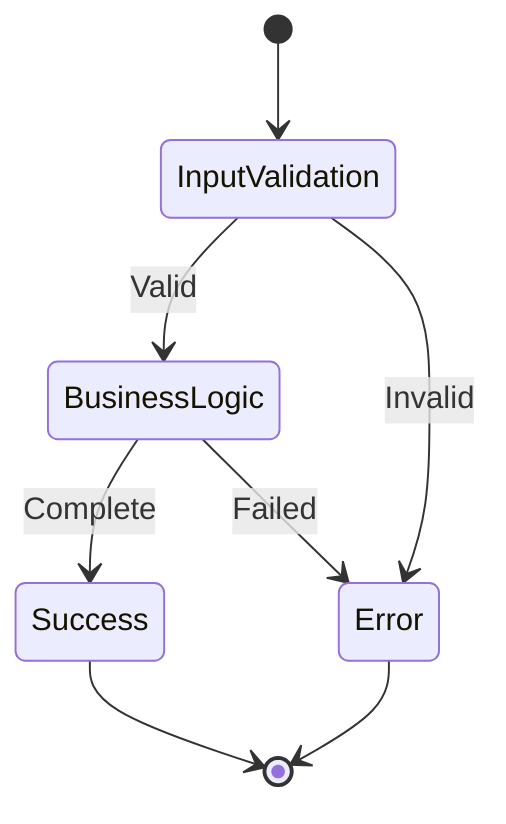
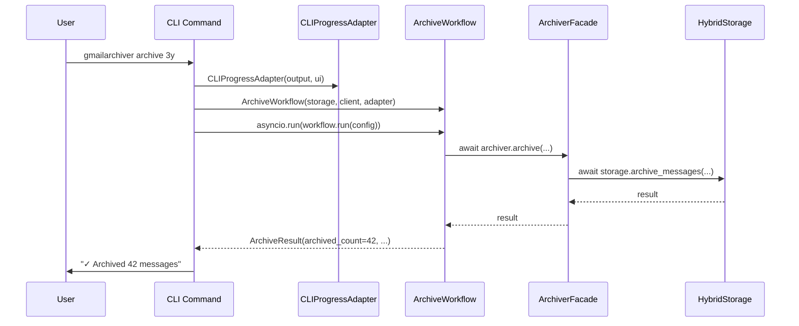
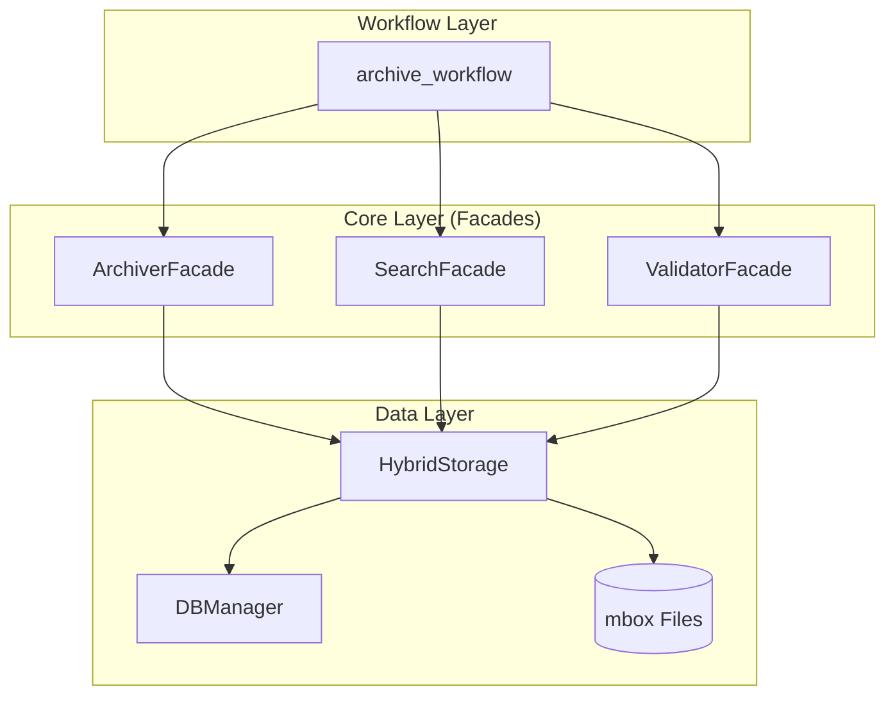

# Workflows Architecture

**Last Updated:** 2025-12-16
**Status:** Production (v1.8.0+)

This document defines the architecture of the workflows module, which contains the async business logic for all CLI commands. Workflows are **class-based** with a `run()` method and use **protocol-based dependency injection** to maintain layer boundaries.

## Design Principles

### Thin Client Pattern

The workflows module implements the **thin client pattern** where:

1. **CLI commands are synchronous** (due to Typer limitations)
2. **Workflows are asynchronous** (business logic)
3. **Single `asyncio.run()` call per command** bridges the sync/async boundary
4. **Workflows depend on protocols, not CLI types** (ProgressReporter, not OutputManager)



### Single Responsibility Principle

Each workflow:
- Handles **one command**
- Has **one public method: `async def run(config: TConfig) -> TResult`**
- Contains **business logic only** (no CLI formatting)
- Returns **typed Result dataclass** for CLI to format
- Implements **WorkflowProtocol[TConfig, TResult]**

### Workflow Lifecycle



## Component Design

### Workflow Class Pattern

Workflows are **classes** with typed Config and Result dataclasses:

```python
from dataclasses import dataclass
from typing import Any

@dataclass
class ArchiveConfig:
    """Configuration for archive workflow."""
    age_threshold: str
    output_file: str | None = None
    compress: str | None = None
    incremental: bool = True
    dry_run: bool = False

@dataclass
class ArchiveResult:
    """Result from archive workflow."""
    archived_count: int
    skipped_count: int
    output_file: str
    validation_passed: bool
    validation_details: dict[str, Any] | None = None

class ArchiveWorkflow:
    """Workflow for archiving Gmail messages.

    Dependencies are injected via constructor for testability
    and explicit contracts.
    """

    def __init__(
        self,
        storage: HybridStorage,
        client: GmailClient,
        progress: ProgressReporter | None = None,
    ) -> None:
        self.storage = storage
        self.client = client
        self.progress = progress

    async def run(self, config: ArchiveConfig) -> ArchiveResult:
        """Execute the archive workflow.

        Args:
            config: Archive configuration dataclass

        Returns:
            ArchiveResult with operation outcomes

        Raises:
            ArchiveWorkflowError: On business logic failures
        """
        ...
```

### Dependency Injection Pattern

Workflows receive dependencies via **constructor injection**, not CommandContext:

| Dependency | Type | Purpose |
|------------|------|---------|
| `storage` | `HybridStorage` | Data access (REQUIRED) |
| `client` | `GmailClient` | Gmail API access (as needed) |
| `progress` | `ProgressReporter` | Progress reporting (OPTIONAL) |

**Key Principle**: Workflows depend on the `ProgressReporter` **protocol**, not concrete CLI types like `OutputManager`. This maintains layer boundaries.

### Error Handling

Workflows should:
- Catch and handle **business logic errors**
- Let **validation errors** propagate (CLI handles user-facing messages)
- Return **structured error data** for CLI formatting
- Use **custom exceptions** for workflow-specific errors

```python
class WorkflowError(Exception):
    """Base class for workflow errors."""
    pass

class ArchiveWorkflowError(WorkflowError):
    """Archive-specific workflow errors."""
    pass
```

### ProgressReporter Protocol

The `ProgressReporter` protocol abstracts progress reporting, allowing workflows to remain independent of CLI types:

```python
from typing import Protocol, ContextManager

class TaskHandle(Protocol):
    """Protocol for individual task progress."""
    def set_status(self, status: str) -> None: ...
    def complete(self, message: str) -> None: ...
    def fail(self, message: str, reason: str | None = None) -> None: ...

class TaskSequence(Protocol):
    """Protocol for multi-step operation sequences."""
    def task(self, description: str, total: int | None = None) -> ContextManager[TaskHandle]: ...

class ProgressReporter(Protocol):
    """Protocol for reporting workflow progress.

    Implementations:
    - CLIProgressAdapter: Rich terminal output (CLI layer)
    - TestProgressReporter: Captures calls for testing
    - NoOpProgressReporter: Silent fallback
    """
    def info(self, message: str) -> None: ...
    def warning(self, message: str) -> None: ...
    def task_sequence(self) -> ContextManager[TaskSequence]: ...
```

**CLI Adapter Implementation** (in `cli/` layer):

```python
class CLIProgressAdapter:
    """Adapts OutputManager/UIBuilder to ProgressReporter protocol."""

    def __init__(self, output: OutputManager, ui: UIBuilder | None = None) -> None:
        self._output = output
        self._ui = ui

    def info(self, message: str) -> None:
        self._output.info(message)

    def warning(self, message: str) -> None:
        self._output.warning(message)

    @contextmanager
    def task_sequence(self) -> ContextManager[TaskSequence]:
        if self._ui:
            yield self._ui.task_sequence()
        else:
            yield NoOpTaskSequence()
```

## Data Flow

### Command Execution Flow



### Progress Reporting

Workflows report progress using the injected `ProgressReporter` protocol:

```python
class ArchiveWorkflow:
    def __init__(self, storage: HybridStorage, client: GmailClient,
                 progress: ProgressReporter | None = None) -> None:
        self.storage = storage
        self.client = client
        self.progress = progress

    async def run(self, config: ArchiveConfig) -> ArchiveResult:
        # Report progress via protocol (if available)
        if self.progress:
            self.progress.info(f"Starting archive with threshold: {config.age_threshold}")
```

### Task Sequences

For multi-step operations, use `progress.task_sequence()`:

```python
async def run(self, config: ArchiveConfig) -> ArchiveResult:
    if self.progress:
        with self.progress.task_sequence() as seq:
            with seq.task("Scanning messages") as t:
                messages = await self._scan_messages(config.age_threshold)
                t.complete(f"Found {len(messages):,} messages")

            with seq.task("Archiving messages", total=len(messages)) as t:
                result = await self._archive_batch(messages, config)
                t.complete(f"Archived {result.archived_count:,} messages")

    return ArchiveResult(...)
```

### Facade Pattern

**Critical Architecture Rule:** Workflows MUST use facades, which in turn use HybridStorage.



**Correct Architecture Flow:**
```
CLI Command (sync)
  → Create adapter: CLIProgressAdapter(output, ui)
  → Create workflow: ArchiveWorkflow(storage, client, adapter)
  → asyncio.run(workflow.run(config))
  → Workflow.run() (async)
  → Core Facade (async)
  → HybridStorage (async)
  → DBManager (async) + mbox (sync via to_thread)
```

**Example with proper facade usage:**
```python
class ArchiveWorkflow:
    def __init__(self, storage: HybridStorage, client: GmailClient,
                 progress: ProgressReporter | None = None) -> None:
        self.storage = storage
        self.client = client
        self.progress = progress
        # Initialize facade with injected dependencies
        self.archiver = ArchiverFacade(
            gmail_client=client,
            db_manager=storage.db,
            storage=storage,
        )

    async def run(self, config: ArchiveConfig) -> ArchiveResult:
        # Facade handles business logic and uses HybridStorage internally
        result = await self.archiver.archive(
            config.age_threshold, config.output_file, config.compress
        )

        # Return typed result dataclass for CLI formatting
        return ArchiveResult(
            archived_count=result.count,
            skipped_count=result.skipped,
            output_file=result.file,
            validation_passed=result.validated,
        )
```

**Why this matters:**
- Facades provide business logic abstraction
- HybridStorage ensures atomic operations
- No direct DBManager access from workflows
- Maintains layer boundaries
- **ProgressReporter protocol** keeps workflows CLI-agnostic

## Integration Points

### Dependencies

```python
# From core layer (FACADES ONLY)
from gmailarchiver.core.archiver import ArchiverFacade
from gmailarchiver.core.search import SearchFacade
from gmailarchiver.core.validator import ValidatorFacade
from gmailarchiver.core.importer import ImporterFacade
from gmailarchiver.core.consolidator import ArchiveConsolidator
from gmailarchiver.core.deduplicator import DeduplicatorFacade
from gmailarchiver.core.extractor import MessageExtractor
from gmailarchiver.core.compressor import ArchiveCompressor
from gmailarchiver.core.doctor import DoctorFacade

# From data layer (via constructor injection)
from gmailarchiver.data.hybrid_storage import HybridStorage

# From connectors layer (via constructor injection)
from gmailarchiver.connectors.gmail_client import GmailClient

# From shared layer (protocols)
from gmailarchiver.core.workflows.protocols import ProgressReporter

# NEVER import these in workflows:
# ❌ from gmailarchiver.cli.output import OutputManager  # CLI-specific
# ❌ from gmailarchiver.cli.command_context import CommandContext  # CLI-specific
# ❌ from gmailarchiver.cli.ui_builder import UIBuilder  # CLI-specific
# ❌ from gmailarchiver.data import DBManager  # Use via HybridStorage/facades
```

### Dependents

```python
# CLI commands import workflow classes and create adapters
from gmailarchiver.core.workflows import ArchiveWorkflow, ArchiveConfig
from gmailarchiver.cli.adapters import CLIProgressAdapter

@app.command()
def archive(age_threshold: str, ...):
    # 1. Create dependencies
    storage = HybridStorage(db_path)
    client = GmailClient(credentials)
    adapter = CLIProgressAdapter(output, ui)

    # 2. Create workflow with constructor injection
    workflow = ArchiveWorkflow(storage, client, progress=adapter)

    # 3. Create typed config
    config = ArchiveConfig(age_threshold=age_threshold, ...)

    # 4. Execute workflow (single asyncio.run)
    result = asyncio.run(workflow.run(config))

    # 5. Format and display result (CLI responsibility)
    output.success(f"Archived {result.archived_count} messages")
```

## Testing Strategy

### Test Coverage Requirements

| Component | Coverage Target | Test Focus |
|-----------|-----------------|------------|
| Workflows | 95%+ | Business logic, error handling, edge cases |
| CLI Commands | 80%+ | Parameter validation, output formatting |

### Test Patterns

**Workflow Tests (with mock dependencies):**
```python
@pytest.mark.asyncio
async def test_archive_workflow_success():
    # Arrange - create mock dependencies
    storage = Mock(spec=HybridStorage)
    client = Mock(spec=GmailClient)
    progress = Mock(spec=ProgressReporter)

    workflow = ArchiveWorkflow(storage, client, progress)
    config = ArchiveConfig(age_threshold="3y", output_file="output.mbox")

    # Act
    result = await workflow.run(config)

    # Assert - typed result
    assert isinstance(result, ArchiveResult)
    assert result.archived_count > 0
    assert result.validation_passed
```

**CLI Command Tests (workflow is mocked):**
```python
def test_archive_command_calls_workflow():
    # Arrange
    with patch("gmailarchiver.core.workflows.ArchiveWorkflow") as MockWorkflow:
        mock_instance = MockWorkflow.return_value
        mock_instance.run = AsyncMock(return_value=ArchiveResult(
            archived_count=42, skipped_count=0, output_file="out.mbox",
            validation_passed=True
        ))

        # Act
        archive_command("3y", "output.mbox")

        # Assert
        MockWorkflow.assert_called_once()
        mock_instance.run.assert_called_once()
```

## Migration Checklist

When creating or migrating a workflow:

1. [ ] Create workflow **class** in `core/workflows/` with `run()` method
2. [ ] Define **Config dataclass** for workflow parameters
3. [ ] Define **Result dataclass** for typed return values
4. [ ] Use **constructor injection** for dependencies (storage, client, progress)
5. [ ] Depend on **ProgressReporter protocol**, not CLI types
6. [ ] Move business logic from CLI command to workflow
7. [ ] Create **CLIProgressAdapter** in CLI layer
8. [ ] Update CLI command to instantiate workflow and call `asyncio.run(workflow.run(config))`
9. [ ] Ensure **single `asyncio.run()` call** per command
10. [ ] Update tests with mock dependencies

## Related Documentation

- **[docs/ARCHITECTURE.md](../../../docs/ARCHITECTURE.md)** - System-wide architecture
- **[cli/ARCHITECTURE.md](../../cli/ARCHITECTURE.md)** - CLI layer design
- **[core/ARCHITECTURE.md](../../core/ARCHITECTURE.md)** - Business logic layer
- **[docs/PROCESS.md](../../../docs/PROCESS.md)** - Development workflow
