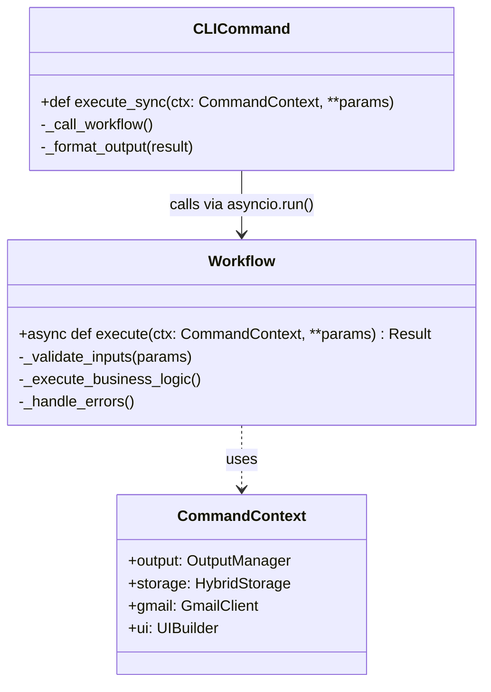
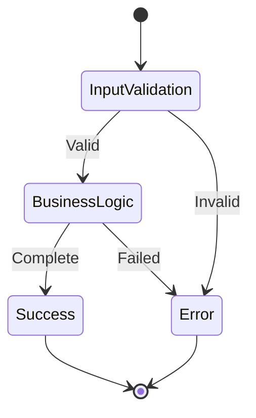
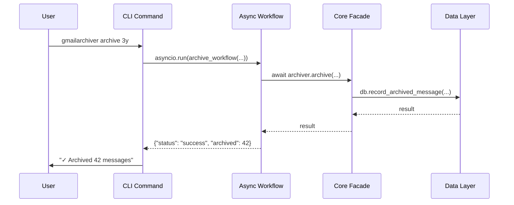
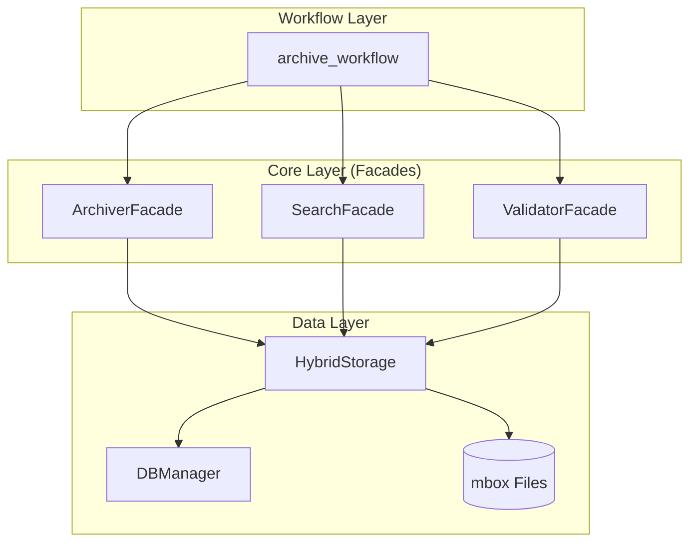

# Workflows Architecture

**Last Updated:** 2025-12-08
**Status:** Production (v1.7.0+)

This document defines the architecture of the workflows module, which contains the async business logic for all CLI commands.

## Design Principles

### Thin Client Pattern

The workflows module implements the **thin client pattern** where:

1. **CLI commands are synchronous** (due to Typer limitations)
2. **Workflows are asynchronous** (business logic)
3. **Single `asyncio.run()` call per command** bridges the sync/async boundary
4. **Workflows contain no CLI-specific code** (no Typer, no OutputManager)



### Single Responsibility Principle

Each workflow:
- Handles **one command**
- Has **one public async function**
- Contains **business logic only** (no CLI formatting)
- Returns **structured data** for CLI to format

### Workflow Lifecycle



## Component Design

### Workflow Function Signature

```python
async def workflow_name(
    ctx: CommandContext,
    param1: Type1,
    param2: Type2,
    # ... other parameters
) -> ResultType:
    """Async implementation of [command] command.
    
    Args:
        ctx: CommandContext with dependencies
        param1: Description
        param2: Description
        
    Returns:
        Structured result data for CLI formatting
        
    Raises:
        WorkflowError: On business logic failures
    """
```

### CommandContext Usage

Workflows receive `CommandContext` for:
- **Database access**: `ctx.storage` (HybridStorage)
- **Gmail client**: `ctx.gmail` (GmailClient)
- **Output**: `ctx.output` (OutputManager) - for progress reporting only
- **UI**: `ctx.ui` (UIBuilder) - for task sequences

**Important**: Workflows should NOT use `ctx.output` for final formatting - that's the CLI's responsibility.

### Error Handling

Workflows should:
- Catch and handle **business logic errors**
- Let **validation errors** propagate (CLI handles user-facing messages)
- Return **structured error data** for CLI formatting
- Use **custom exceptions** for workflow-specific errors

```python
class WorkflowError(Exception):
    """Base class for workflow errors."""
    pass

class ArchiveWorkflowError(WorkflowError):
    """Archive-specific workflow errors."""
    pass
```

## Data Flow

### Command Execution Flow



### Progress Reporting

Workflows can report progress using `ctx.output`:

```python
async def archive_workflow(ctx: CommandContext, ...):
    with ctx.output.progress_context("Archiving messages", total=count) as progress:
        task = progress.add_task("Archiving", total=count)
        
        for message in messages:
            await archiver.archive(message)
            progress.update(task, advance=1)
            
        progress.update(task, completed=count)
```

### Task Sequences

For multi-step operations, use `ctx.ui.task_sequence()`:

```python
async def archive_workflow(ctx: CommandContext, ...):
    with ctx.ui.task_sequence() as seq:
        with seq.task("Authenticating") as t:
            await authenticate()
            t.complete("Connected")
            
        with seq.task("Archiving messages") as t:
            result = await archiver.archive()
            t.complete(f"Archived {result.count} messages")
```

### Facade Pattern

**Critical Architecture Rule:** Workflows MUST use facades, which in turn use HybridStorage.



**Correct Architecture Flow:**
```
CLI Command (sync)
  → asyncio.run(workflow(...))
  → Workflow (async)
  → Core Facade (async)
  → HybridStorage (async)
  → DBManager (async) + mbox (sync via to_thread)
```

**Example with proper facade usage:**
```python
async def archive_workflow(ctx: CommandContext, age_threshold: str, ...):
    # Use facade from core layer (NOT direct core components)
    archiver = ArchiverFacade(ctx.gmail, ctx.storage)
    
    # Facade handles business logic and uses HybridStorage internally
    result = await archiver.archive(age_threshold, output, compress)
    
    # Return structured data for CLI formatting
    return {
        "status": "success",
        "archived": result.count,
        "output_file": result.file,
    }
```

**Why this matters:**
- Facades provide business logic abstraction
- HybridStorage ensures atomic operations
- No direct DBManager access from workflows
- Maintains layer boundaries

## Integration Points

### Dependencies

```python
# From core layer (FACADES ONLY)
from gmailarchiver.core.archiver import ArchiverFacade
from gmailarchiver.core.search import SearchFacade
from gmailarchiver.core.validator import ValidatorFacade
from gmailarchiver.core.importer import ImporterFacade
from gmailarchiver.core.consolidator import ArchiveConsolidator
from gmailarchiver.core.deduplicator import DeduplicatorFacade
from gmailarchiver.core.extractor import MessageExtractor
from gmailarchiver.core.compressor import ArchiveCompressor
from gmailarchiver.core.doctor import DoctorFacade

# From CLI layer (CommandContext only)
from gmailarchiver.cli.command_context import CommandContext

# NEVER import these directly in workflows:
# ❌ from gmailarchiver.data import DBManager  # Use via HybridStorage
# ❌ from gmailarchiver.data import HybridStorage  # Use via facades
# ❌ from gmailarchiver.core import GmailArchiver  # Use facades
```

### Dependents

```python
# CLI commands import and call workflows
from gmailarchiver.core.workflows import archive_workflow

@app.command()
def archive(ctx: CommandContext, ...):
    result = asyncio.run(archive_workflow(ctx, ...))
    # Format and display result
```

## Testing Strategy

### Test Coverage Requirements

| Component | Coverage Target | Test Focus |
|-----------|-----------------|------------|
| Workflows | 95%+ | Business logic, error handling, edge cases |
| CLI Commands | 80%+ | Parameter validation, output formatting |

### Test Patterns

**Workflow Tests:**
```python
@pytest.mark.asyncio
async def test_archive_workflow_success():
    # Arrange
    ctx = create_test_context()
    
    # Act
    result = await archive_workflow(ctx, "3y", "output.mbox")
    
    # Assert
    assert result["status"] == "success"
    assert result["archived"] > 0
```

**CLI Command Tests:**
```python
def test_archive_command_calls_workflow():
    # Arrange
    ctx = create_test_context()
    
    # Act
    with patch("gmailarchiver.core.workflows.archive_workflow") as mock_workflow:
        mock_workflow.return_value = {"status": "success"}
        archive_command(ctx, "3y", "output.mbox")
    
    # Assert
    mock_workflow.assert_called_once()
```

## Migration Checklist

When moving code from CLI to workflows:

1. [ ] Create workflow function in `core/workflows/`
2. [ ] Move business logic from CLI command to workflow
3. [ ] Update CLI command to call workflow via `asyncio.run()`
4. [ ] Ensure workflow returns structured data
5. [ ] Update CLI command to format workflow results
6. [ ] Verify single `asyncio.run()` call per command
7. [ ] Update tests to cover both workflow and CLI layers

## Related Documentation

- **[docs/ARCHITECTURE.md](../../../docs/ARCHITECTURE.md)** - System-wide architecture
- **[cli/ARCHITECTURE.md](../../cli/ARCHITECTURE.md)** - CLI layer design
- **[core/ARCHITECTURE.md](../../core/ARCHITECTURE.md)** - Business logic layer
- **[docs/PROCESS.md](../../../docs/PROCESS.md)** - Development workflow
